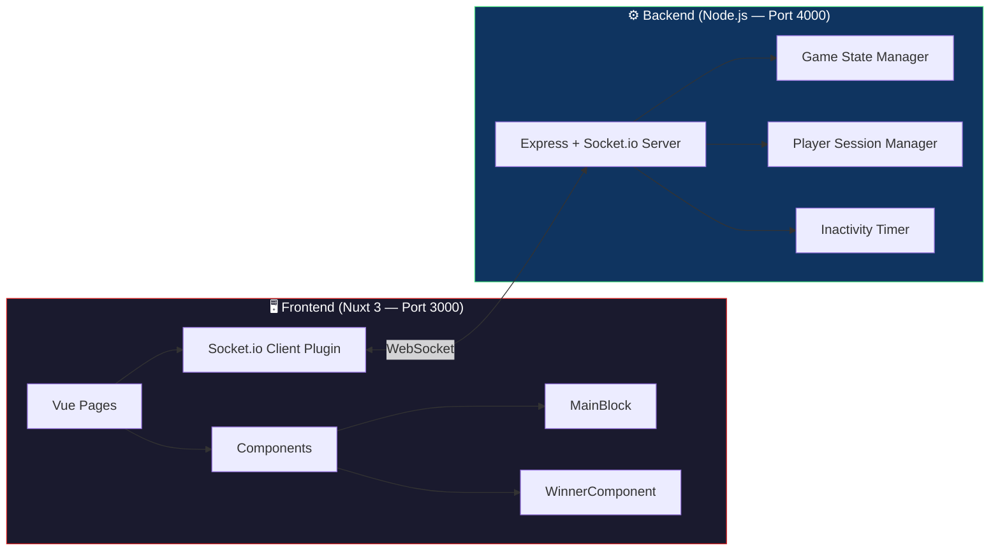

<div align="center">

# 🎮 Ultimate Tic-Tac-Toe

### A real-time, multiplayer twist on the classic — built with Nuxt 3 & Socket.io

[](https://vuejs.org/)
[](https://nuxt.com/)
[](https://socket.io/)
[](https://nodejs.org/)
[](https://www.docker.com/)
[](https://getbootstrap.com/)

---

**Ultimate Tic-Tac-Toe** takes the classic game to a whole new level.  
Instead of one 3×3 grid, you play on **9 interconnected boards** — where every move dictates your opponent's next battlefield.

🔴 Strategy · ⚡ Real-Time · 🌐 Multiplayer · 🐳 Dockerized

</div>

---

## 📖 Table of Contents

- [🎯 Game Rules](#-game-rules)
- [✨ Features](#-features)
- [🏗️ Architecture](#️-architecture)
- [🛠️ Tech Stack](#️-tech-stack)
- [🚀 Getting Started](#-getting-started)
  - [Prerequisites](#prerequisites)
  - [Docker Setup (Recommended)](#-docker-setup-recommended)
  - [Manual Setup](#-manual-setup)
- [📁 Project Structure](#-project-structure)
- [🔌 Socket Events API](#-socket-events-api)
- [🎨 UI & Design](#-ui--design)
- [🤝 Contributing](#-contributing)
- [📄 License](#-license)

---

## 🎯 Game Rules

Ultimate Tic-Tac-Toe is a strategic variant where **each cell of the main board contains a smaller 3×3 grid**:

```
┌───────────┬───────────┬───────────┐
│  ┌─┬─┬─┐  │  ┌─┬─┬─┐  │  ┌─┬─┬─┐  │
│  ├─┼─┼─┤  │  ├─┼─┼─┤  │  ├─┼─┼─┤  │
│  ├─┼─┼─┤  │  ├─┼─┼─┤  │  ├─┼─┼─┤  │
│  └─┴─┴─┘  │  └─┴─┴─┘  │  └─┴─┴─┘  │
├───────────┼───────────┼───────────┤
│  ┌─┬─┬─┐  │  ┌─┬─┬─┐  │  ┌─┬─┬─┐  │
│  ├─┼─┼─┤  │  ├─┼─┼─┤  │  ├─┼─┼─┤  │
│  ├─┼─┼─┤  │  ├─┼─┼─┤  │  ├─┼─┼─┤  │
│  └─┴─┴─┘  │  └─┴─┴─┘  │  └─┴─┴─┘  │
├───────────┼───────────┼───────────┤
│  ┌─┬─┬─┐  │  ┌─┬─┬─┐  │  ┌─┬─┬─┐  │
│  ├─┼─┼─┤  │  ├─┼─┼─┤  │  ├─┼─┼─┤  │
│  ├─┼─┼─┤  │  ├─┼─┼─┤  │  ├─┼─┼─┤  │
│  └─┴─┴─┘  │  └─┴─┴─┘  │  └─┴─┴─┘  │
└───────────┴───────────┴───────────┘
```

| Rule | Description |
|------|-------------|
| **🎲 First Move** | Player X starts and can play in **any** of the 9 small boards |
| **🎯 Directed Play** | Your move's **position within a small board** determines which board your opponent must play in next |
| **🏆 Winning a Block** | Win a small board by getting 3-in-a-row (horizontally, vertically, or diagonally) |
| **♟️ Won Block** | Once a small board is won, it's claimed — no more moves can be made there |
| **🔓 Free Choice** | If sent to an already-won board, the opponent can play in **any** open board |
| **🥇 Overall Victory** | Win the game by claiming **3 small boards in a row** on the outer grid |
| **🤝 Draw** | If all cells are filled with no winner, the game ends in a draw |

---

## ✨ Features

| Category | Feature |
|----------|---------|
| 🌐 **Multiplayer** | Real-time gameplay via **WebSocket** connections |
| 🏠 **Room System** | Create or join games using a unique **8-digit Room ID** |
| 🔄 **Reconnection** | Automatic session recovery with **player identity persistence** (UUID-based) |
| ⏱️ **Inactivity Timer** | 60-second move timer with **2-strike timeout** system |
| 🖥️ **Responsive Design** | Fully adaptive 3-column layout — desktop, tablet, and mobile |
| 🎆 **Win Animations** | Lottie-powered **celebration animations** on victory |
| 🔔 **Toast Notifications** | Real-time feedback via **nuxt-toastify** |
| 📋 **Clipboard Copy** | One-click Room ID copy with **fallback** for non-HTTPS contexts |
| 🐳 **Docker Ready** | One-command deployment with **Docker Compose** |
| 🌙 **Dark Theme** | Sleek dark UI with **glassmorphism** and red accent design |
| ✨ **Hover Previews** | Ghost move preview on hover before committing |
| 📊 **Live Scoreboard** | Real-time block-win tracking per player |

---

## 🏗️ Architecture



### Data Flow

```
Player A (Browser)                    Server                    Player B (Browser)
     │                                  │                              │
     ├──── create_game ────────────────►│                              │
     │◄──── game_created ──────────────┤                              │
     │                                  │◄──── join_game ─────────────┤
     │◄──── player_joined ────────────┤──── symbol_assigned ────────►│
     │◄──── game_update ──────────────┤──── game_update ────────────►│
     │                                  │                              │
     ├──── make_move ──────────────────►│                              │
     │◄──── game_update ──────────────┤──── game_update ────────────►│
     │                                  │                              │
```

---

## 🛠️ Tech Stack

### Frontend
| Technology | Purpose |
|------------|---------|
| **Nuxt 3** (v3.13) | Vue 3 meta-framework with SSR/SPA support |
| **Vue 3** (Composition API) | Reactive UI components |
| **Socket.io Client** (v4.7) | Real-time WebSocket communication |
| **Bootstrap 5** (v5.2) | Responsive grid & utility classes |
| **Bootstrap Icons** | Icon library |
| **Pinia** | State management |
| **Lottie Web** | Winner celebration animations |
| **Nuxt Toastify** | Toast notification system |
| **UUID** (v9) | Unique player ID generation |
| **Vitest** | Unit testing framework |

### Backend
| Technology | Purpose |
|------------|---------|
| **Node.js 18** | JavaScript runtime |
| **Express** (v4.18) | HTTP server |
| **Socket.io** (v4.7) | WebSocket server for real-time events |
| **Nodemon** | Hot-reload during development |

### DevOps
| Technology | Purpose |
|------------|---------|
| **Docker** | Containerization |
| **Docker Compose** | Multi-container orchestration |
| **Nginx** + **Supervisor** | Production serving |
| **ESLint** + **Stylelint** | Code quality enforcement |
| **Simple Git Hooks** | Pre-commit linting |

---

## 🚀 Getting Started

### Prerequisites

- **Node.js** ≥ 18.x
- **npm** ≥ 9.x
- **Docker** & **Docker Compose** (for containerized setup)

---

### 🐳 Docker Setup (Recommended)

The fastest way to get up and running:

```bash
# Clone the repository
git clone <repository-url>
cd tictactoi

# Build and start both services
docker compose up --build
```

| Service | URL |
|---------|-----|
| 🖥️ Frontend | [http://localhost:3000](http://localhost:3000) |
| ⚙️ Backend | [http://localhost:4000](http://localhost:4000) |

To stop:

```bash
docker compose down
```

---

### 🔧 Manual Setup

#### 1. Backend Server

```bash
cd tictactoibackendnode

# Install dependencies
npm install

# Start development server (with hot-reload)
npm run dev

# — or — Start production server
npm start
```

> The backend will be available at `http://localhost:4000`

#### 2. Frontend Application

```bash
cd tictactoiFrontend/app

# Install dependencies
npm install

# Start development server
npm run dev
```

> The frontend will be available at `http://localhost:3000`

---

### ⚙️ Environment Configuration

The frontend uses Nuxt runtime config. Override via environment variables:

| Variable | Default | Description |
|----------|---------|-------------|
| `NUXT_PUBLIC_BASE_URL` | `http://localhost:3000` | Public base URL for the app |
| `PORT` | `3000` | Frontend server port |
| `HOST` | `0.0.0.0` | Frontend server host |

```bash
# Example: Custom base URL
NUXT_PUBLIC_BASE_URL=https://yourdomain.com npm run dev
```

---

## 📁 Project Structure

```
tictactoi/
├── docker-compose.yaml              # 🐳 Multi-service orchestration
│
├── tictactoiFrontend/                # 🖥️ Frontend (Nuxt 3)
│   └── app/
│       ├── app.vue                   #    Root Vue component
│       ├── nuxt.config.ts            #    Nuxt configuration
│       ├── package.json              #    Frontend dependencies
│       ├── Dockerfile                #    Frontend container (dev/prod)
│       │
│       ├── pages/
│       │   ├── index.vue             #    🏠 Home — Create/Join game
│       │   └── game.vue              #    🎮 Game — Main gameplay
│       │
│       ├── components/
│       │   ├── MainBlock.vue         #    🧩 Game board (9×9 grid + panels)
│       │   └── WinnerComponent.vue   #    🎆 Lottie win animation
│       │
│       ├── composables/
│       │   └── useSocket.js          #    🔌 Socket utility composable
│       │
│       ├── plugins/
│       │   ├── socket.client.ts      #    ⚡ Socket.io client plugin
│       │   └── bootstrap.client.js   #    🎨 Bootstrap JS initialization
│       │
│       ├── layouts/
│       │   └── default.vue           #    📐 Default page layout
│       │
│       └── assets/
│           ├── css/style.css         #    🎨 Global custom styles
│           └── animations/           #    🎬 Lottie JSON animations
│               └── Win-Result-1.json
│
├── tictactoibackendnode/             # ⚙️ Backend (Node.js)
│   ├── server.js                     #    🧠 Game logic + Socket.io server
│   ├── package.json                  #    Backend dependencies
│   └── dockerfile                    #    Backend container
```

---

## 🔌 Socket Events API

### Client → Server

| Event | Payload | Description |
|-------|---------|-------------|
| `create_game` | `{ name, playerId }` | Create a new game room |
| `join_game` | `{ gameId, playerName, playerId }` | Join an existing room |
| `make_move` | `{ gameId, block, position }` | Place X or O on the board |
| `get_game_state` | `{ gameId }` | Request current game state |
| `identify` | `{ playerId }` | Re-identify after reconnection |
| `leave_game` | `{ gameId }` | Leave the current game |

### Server → Client

| Event | Payload | Description |
|-------|---------|-------------|
| `game_created` | `{ gameId, symbol }` | Room created successfully |
| `game_update` | `{ gameId, board, winningBlocks, turn, players, winner, currentBlock, playerNames }` | Full game state broadcast |
| `symbol_assigned` | `'O'` | Symbol assigned to joining player |
| `player_joined` | `{ playerName, symbol }` | Opponent has joined the room |
| `inactivity_warning` | `{ player, strikes }` | Inactivity strike notice |
| `error` | `string` | Error message |

---

## 🎨 UI & Design

The interface follows a **dark glassmorphism** design language:

- **Color Palette**: Deep black background (`#141414`) with red accents (`#dc2626`) and green highlights (`#4ade80`)
- **Glassmorphism**: Frosted glass panels with `backdrop-filter: blur()` and subtle borders
- **Typography**: Poppins font with glowing text animations
- **Layout**: Responsive 3-column grid (panels · board · panels) collapsing to single column on mobile
- **Micro-interactions**: Hover previews, scale animations, and glow effects
- **Win Celebration**: Full-screen Lottie animation overlay with pulsating winner text

### Responsive Breakpoints

| Breakpoint | Layout |
|------------|--------|
| ≥ 992px | 3-column: Side Panel — Board — Side Panel |
| 768px – 991px | Single column, panels side-by-side below board |
| 577px – 767px | Single column, compact panels |
| ≤ 480px | Single column, stacked panels, minimal padding |
| ≤ 360px | Ultra-compact mobile view |

---